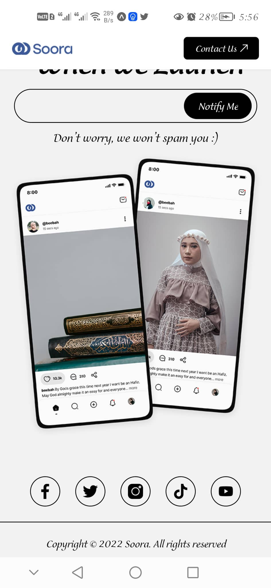
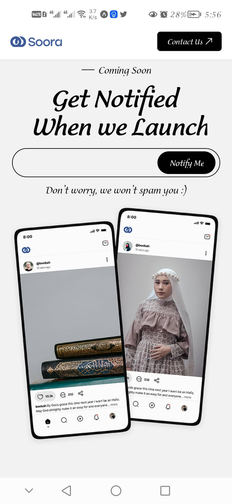

# Soora

> A landing page for upcoming new mobile application

## Screenshots

## Built With

- React Native

## Prerequisites

- [React](https://reactjs.org/docs/getting-started.html)
- [React Native](https://reactnative.dev/docs/getting-started)

## Installation

Go to your terminal, navigate to your working directory and run

`git clone git@github.com:ReAliens/Soora-RN.git`

After that navigate to the newly created folder

`cd Soora-RN`

You now have access to the files.
To install necessary dependencies run

`npm install`

Start a local server running the command

on your mobile devide install expo app from app store or play store then follow the instructions

`npm start`

You should now have the project running locally on a dev server.

## Author

👤 **Ahmed Reda**

- GitHub: [@ReAliens](https://github.com/ReAliens)
- Twitter: [@AhmedRedaMoha19](https://twitter.com/AhmedRedaMoha19)
- LinkedIn: [Ahmed-Reda](https://www.linkedin.com/in/armali/)
- Email: ahmedreda152@gmail.com

## 🤝 Contributing

Contributions, issues, and feature requests are welcome!

Feel free to check the [issues page](../../issues/).

## Show your support

Give a ⭐️ if you like this project!
